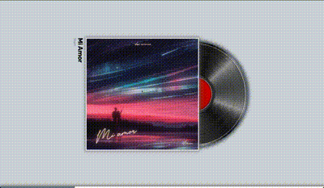

# Vinyl Visualizer for Spotify

An app written in React that provides a vinyl visualizer companion for Spotify.
Built it since I had an free time, empty screen and wanted a vinyl type visualizer for the music I was playing.

## Current Features:

1. Play/Pause tracks
2. Navigate between tracks

Try it out at [Vinyl Spotify Visualizer](https://spotify-vinyl.netlify.app/)
